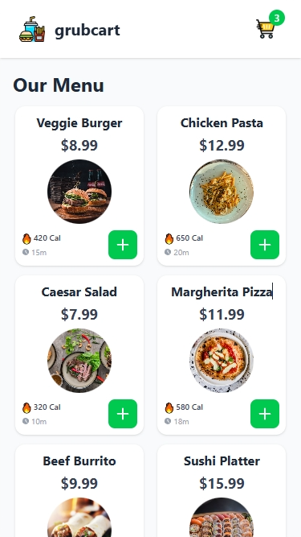

# 🛒 GrubCart App

A modern, mobile-first food cart application built with React and Tailwind CSS. Browse delicious meals, add them to your cart, and enjoy a seamless checkout experience—all with a beautiful, responsive UI.

---

## 🚀 Features

- 📋 Browse a diverse, scrollable menu of food items
- ➕ Add and remove items from the cart with a single tap
- 🔢 Adjust item quantities directly in the cart
- 🛒 Sticky header with live cart badge
- 🧾 Cart modal with mobile-optimized design and smooth transitions
- 💚 Consistent green accent color and modern card UI
- 📱 Fully responsive: mobile-first, works great on desktop too
- 🧠 State management using React Context
- ⚡ Fast, accessible, and production-ready

---

## 🚀 Live Demo

Check out the live version here: [Live Demo](https://rishabh0-0.github.io/GrubCart/)

## 🖼️ Screenshots

               

---

## 🛠️ Tech Stack

- React (with Hooks)
- JavaScript (ES6+)
- Tailwind CSS
- React Context API

---

## © 2025 GrubCart — Made with ❤️ for food lovers.
